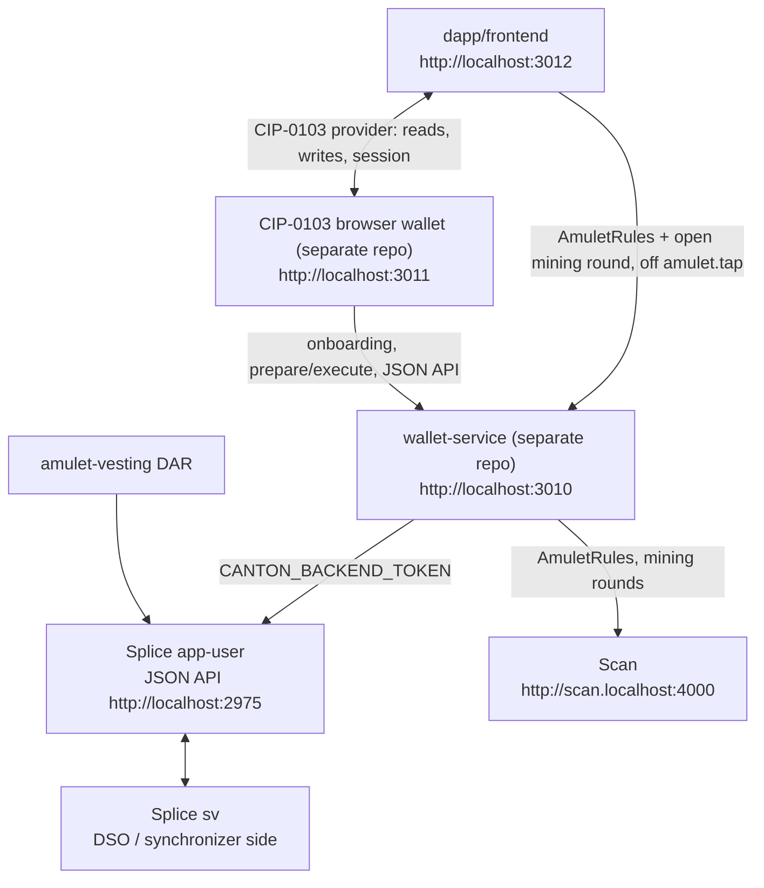
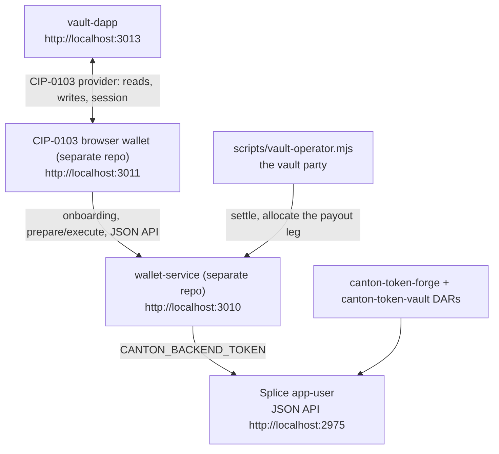

# Architecture Overview — Canton dAppBooster

## Tech Stack

| Subproject | Stack | Purpose |
| --- | --- | --- |
| LocalNet (external: [BootNodeDev/canton-barebones](https://github.com/BootNodeDev/canton-barebones)) | Node CLI over Docker Compose + the official Splice LocalNet bundle | Starts `sv + app-user`. A pinned devDependency, scaffolded by `dev-stack.sh` into the gitignored `.canton-localnet/` |
| `scripts/` | Bash + Node | Both local loops: `dev-stack.sh`, the Splice dep fetch, the DAR build and upload, the token mint, the vesting bootstrap, and the vault's own DAR upload, bootstrap and operator |
| wallet-service (external: [BootNodeDev/canton-wallet-service](https://github.com/BootNodeDev/canton-wallet-service)) | Node 24 + Express 5 + TypeScript + `@canton-network/wallet-sdk` | Bridge the wallet uses for external-party onboarding and participant JSON API calls. A git dependency pinned to a tag, run on the host by `scripts/dev-stack.sh` |
| `dapp/frontend/` | Vite + React + Ark UI + Tailwind v4 + zustand + react-router | Canton Coin **vesting** dApp; every read and write goes through the connected CIP-0103 wallet via `canton-connect` |
| `dapp/daml/` | DAML | `amulet-vesting` DAR: the vesting factory, proposal, contract and residual-claim templates, escrowing real Canton Coin as a Splice `LockedAmulet`. Vendored from [BootNodeDev/cc-vesting-contracts](https://github.com/BootNodeDev/cc-vesting-contracts); its Splice data-dependencies are fetched, not committed |
| `vault-dapp/` | Vite + React + Ark UI + Tailwind v4 + zustand + react-router | Token **vault** dApp: deposit an underlying CIP-0056 token for shares and return the shares for the underlying. Same wallet-only path as the vesting dApp |
| `vault-dapp/vendor/` | DAR artifacts | `canton-token-forge` and `canton-token-vault`, built in [BootNodeDev/canton-token-forge](https://github.com/BootNodeDev/canton-token-forge) and committed here. Nothing in this repository compiles them |
| `canton-connect/` | TypeScript + React 19 | wagmi-style hooks wrapping the dapp-sdk facade |
| `canton-dappbooster/` | TypeScript + React 19 + tsdown | L2 headless UI components, zero styling, plus the theme runtime and the pure utilities under the components, exact-decimal amounts included |
| `canton-theme/` | CSS | L3 plain-CSS theme: `--cnc-*` tokens + prestyled defaults |

Each subproject's `architecture.md` is the index of its own seams. A subsystem that needs more than
a seam gets a chapter in a sibling `architecture/` folder, linked from that index; `canton-connect/`
carries two today.

## Data Flow

> `dapp/frontend` hosts the Canton Coin vesting dApp. Every ledger read and every submission goes
> through the wallet over CIP-0103, so the dApp only ever acts as the connected account and each
> write is signed by the account's own key. One call is not a ledger path: an Amulet-moving choice
> takes the current `AmuletRules` and open mining round as an argument, and no connected party is a
> stakeholder of either, so the dApp asks wallet-service's `amulet.tap` — a pure builder that
> submits nothing — and keeps the two disclosures its answer carries. Deployed, that one call goes
> through the app's own `/api/rpc` function, which forwards it and refuses every other method.

The vault dApp runs the same shape over the same wallet, with the vault party alongside it:

> No registry process and no configuration. Every `InstrumentConfig` disclosure a depositor's write
> needs is read off the ledger rather than fetched from a token registry's HTTP API, which is the
> same shortcut the vesting dApp takes for its factory and works because wallet-service's token can
> read as the bootstrap parties. The vault, both instruments and every disclosure are re-read on
> each load, so a re-bootstrap leaves no stale pointer behind.

`app-user` is the primary local validator from the official Splice LocalNet
bundle. It is not a product user. `sv` provides the Super Validator / DSO side
needed by Splice and Canton Coin. The app-provider UI profile is not started;
its Nginx routes are disabled locally. The official shared Canton/Splice
containers still expose app-provider backend ports.

State boundaries:

- The CIP-0103 path: a dApp talks to the wallet through the provider surface, which is how the vesting dApp in `dapp/frontend` gets its session, its ledger reads, and its submissions.
- The vault dApp takes the same path, with one party outside it: the vault itself is
  participant-hosted, because both `*_Settle` choices are controlled by it and a withdraw needs it
  to allocate its own payout leg. `scripts/vault-operator.mjs` acts as it over wallet-service's
  `/rpc`; nothing in the browser ever submits as the vault.
- The wallet owns user keys and signs locally.
- wallet-service holds `CANTON_BACKEND_TOKEN` and remains the external-party onboarding bridge.
- Splice LocalNet owns the app-user participant/validator, Scan, SV, and CC infrastructure.
- wallet-service is not a container at all: it runs on the host, so it reaches Canton and Splice
  over `localhost` rather than `host.docker.internal`.
- The wallet should use generated bearer tokens for direct LocalNet endpoints; it should not copy `CANTON_AUTH_SECRET` into the browser.

## Services And Ports

| Service | URL / Port | Purpose |
| --- | --- | --- |
| wallet-service | `http://localhost:3010` | wallet bridge for onboarding and JSON API calls |
| CIP-0103 browser wallet | `http://localhost:3011` | browser wallet UI/provider, run from its own repo |
| vesting dApp frontend | `http://localhost:3012` | `dapp/frontend`, the Canton Coin vesting demo |
| vault dApp frontend | `http://localhost:3013` | `vault-dapp`, the token vault demo |
| app-user Wallet UI | `http://wallet.localhost:2000` | optional official Splice wallet UI |
| app-user Ledger API | `grpc://localhost:2901` | SDK/tools |
| app-user Admin API | `grpc://localhost:2902` | wallet-service/tools |
| app-user Validator API | `http://localhost:2903` | health/tools |
| app-user JSON API | `http://localhost:2975` | wallet-service/tools |
| app-user Validator proxy | `http://localhost:2000/api/validator` | wallet/tools |
| app-provider backend APIs | `grpc://localhost:3901`, `grpc://localhost:3902`, `http://localhost:3903`, `http://localhost:3975` | official bundle wiring, unused |
| app-provider UI port | `http://localhost:3000` | exposed by Nginx, routes disabled |
| Scan UI | `http://scan.localhost:4000` | explorer/read model UI |
| Scan API | `http://scan.localhost:4000/api/scan` | wallet/tools |
| Amulet Registry | `http://localhost:2000/api/validator/v0/scan-proxy` | token metadata |
| SV UI | `http://sv.localhost:4000` | Super Validator operations UI |
| sv Ledger/Admin/JSON APIs | `grpc://localhost:4901`, `grpc://localhost:4902`, `http://localhost:4975` | Splice internals/tools |
| sv Validator API | `http://localhost:4903` | health checks |
| PostgreSQL | `localhost:5432` | Splice LocalNet database |

## Auth

| Variable | Owner | Purpose |
| --- | --- | --- |
| `CANTON_AUTH_AUDIENCE` | `.env` | JWT audience recipe used by `scripts/mint-token.mjs` |
| `CANTON_AUTH_SECRET` | `.env` | unsafe local signing secret used only by the token script |
| `CANTON_BACKEND_TOKEN` | `.env` | generated JWT consumed by wallet-service and the DAR upload |

The root `.env` is the only one that matters: wallet-service's whole configuration, since it
loads dotenv from the directory it starts in, plus the signing recipe `scripts/mint-token.mjs`
reads and the token `scripts/deploy-dar.sh` sends. Minting is offline, so it needs nothing
running, which is what lets `dev-stack.sh up` mint `CANTON_BACKEND_TOKEN` into a fresh `.env`
before anything is up. The LocalNet is configured by its own `canton-barebones.config.json`,
scaffolded into `.canton-localnet/` and tracked by nothing.

`CANTON_AUTH_AUDIENCE` plus `CANTON_AUTH_SECRET` is the local signing recipe.
`CANTON_BACKEND_TOKEN` is the generated token. The token script defaults the
JWT subject to `ledger-api-user`; the wallet can use a separate token generated
with the same script, configured manually in its LocalNet settings.

## Orchestration

| Command | What it does |
| --- | --- |
| `./scripts/dev-stack.sh up` | the vesting loop: LocalNet, DAR, wallet-service on 3010, bootstrap, dApp dev server on 3012 |
| `./scripts/dev-stack.sh vault-up` | the vault loop: LocalNet, both vendored DARs, wallet-service on 3010, bootstrap, the vault operator, dApp dev server on 3013 |
| `./scripts/dev-stack.sh down` | stop every dev server and the operator, stop the LocalNet. `vault-down` is the same action, since the two stacks share the LocalNet and wallet-service |
| `pnpm exec canton-barebones start` / `stop` / `reset` / `status` | the LocalNet itself, run from `.canton-localnet/` |
| `node scripts/localnet-config.mjs <dir>` | scaffold that directory and apply the flags nginx needs |
| `pnpm run mint-token` | generate a LocalNet dev JWT, offline |
| `pnpm run build-dar` | fetch the Splice deps, then compile the DAR with `dpm` |
| `pnpm run deploy-dar -- <dar>` | upload DAR to app-user JSON API |
| `pnpm run bootstrap` | create the vesting operator and its factory |
| `pnpm run app:dev` | start the vesting dApp frontend |
| `pnpm run vendor-vault-dars` | rebuild both vault DARs from a local forge checkout; the one command needing `dpm` |
| `pnpm run deploy-vault-dars` | upload both vendored vault DARs to app-user JSON API |
| `pnpm run bootstrap-vault` | create the issuer and vault parties, both instruments and the Vault |
| `pnpm run vault-operator` | run the vault's backstage signer; leave it running |
| `pnpm run vault:dev` | start the vault dApp frontend |

`dev-stack.sh` shells out to the LocalNet tool in the directory passed as its second argument
(`./scripts/dev-stack.sh up <dir>`), else `CANTON_LOCALNET_DIR`, else `.canton-localnet/`. It
scaffolds that directory on `up` from the pinned tool's own template, re-scaffolding when the
template moves past the local copy, so the config drifts from the installed version rather than
from a committed file. The Splice checkout and the runtime env land in its `.generated/`.

For the bring-up sequence, follow [`README.md`](README.md).
