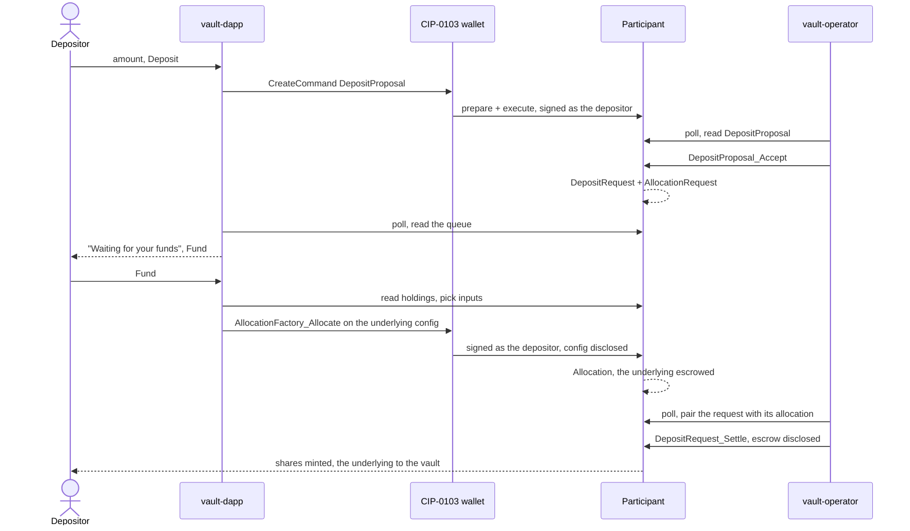
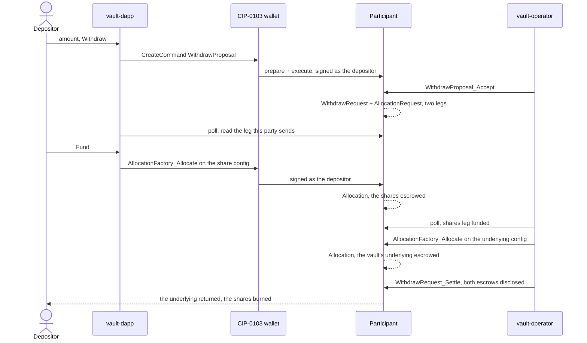

# Architecture: Token vault dApp

The app's internal seams and the reasoning behind them. What this is and how to run it is in
[`README.md`](README.md); the local rules an agent editing here needs are in
[`CLAUDE.md`](CLAUDE.md), repo-wide ones in [`../CLAUDE.md`](../CLAUDE.md) and the cross-component
picture in [`../architecture.md`](../architecture.md).

Two constraints shape everything below. The wallet is the only way in, so the browser only ever
reads and submits as the connected account. And the vault party is not a wallet account: both
`*_Settle` choices are controlled by it and a withdraw needs it to allocate its own payout leg, so
it is participant-hosted and [`../scripts/vault-operator.mjs`](../scripts/vault-operator.mjs) acts
as it. Neither side can complete a deposit or a withdraw alone, which is why every flow here is a
handoff between the two.

## Parts

| Path | Role |
|------|------|
| `src/backend/` | The `VaultBackend` interface, `LedgerBackend` (its one implementation), the `WalletFns` seam, `acs.ts` (the shared JSON Ledger API reads), `deployment.ts` (the discovery load), `requests.ts` (the queue read), `commands.ts` (the pure command builders) and `selectInputs.ts` (which holdings fund an allocation). |
| `src/providers/` | `Backend` waits for a wallet party, loads the deployment off the ledger and builds the backend from it; `Tokens` sits inside it and builds the token list from the deployment's two instruments plus the connected party's holdings, then hands it to the kit's `TokenListProvider` and publishes the vault's TVL alongside. The theme provider comes from the kit, the session provider from `canton-connect`. |
| `src/store/useVaultStore.ts` | The request queue as zustand state, plus `useVault`, which wires it to the backend and the party and polls. Every write submits then re-reads. |
| `src/hooks/` | `useParty` narrows the `canton-connect` session to what the UI needs; `useConnectErrorToast` gives a rejected connection somewhere to surface. |
| `src/utils/` | Pure helpers. `requestState.ts` is the one that matters: it turns a proposal or a request into the state and the action a row owes. `toast.ts` holds the Ark toaster that `components/Toaster/` renders. |
| `src/components/` | What two or more places render: the shell, the top bar, the connect prompt, and the primitives the page composes. |
| `src/pages/Vault/` | The one route. `index.tsx` composes the balances, the faucet, the two proposal forms and the queue; its siblings are what only it renders. |
| `src/styles/` | The single stylesheet entry and the app's own tokens. |
| `vendor/` | The two built DARs, `canton-token-forge` and `canton-token-vault`. Nothing here compiles them; see [`vendor/PROVENANCE.md`](vendor/PROVENANCE.md). |

## The three seams

**`VaultBackend`** ([`src/backend/VaultBackend.ts`](src/backend/VaultBackend.ts)) is what the UI
depends on. It speaks proposals, requests, holdings and the four actions a depositor can take, never
DAML templates or transport. `LedgerBackend` satisfies it against the `canton-token-vault` package.
Because the mappers that turn active-contract rows into those types sit behind this interface, no
component knows the ledger exists.

**`WalletFns`** ([`src/backend/wallet.ts`](src/backend/wallet.ts)) is the narrower one: the two
session calls `LedgerBackend` makes, `execute` and `ledgerApi`, injected as plain functions rather
than implemented by a class. They come straight from `canton-connect`'s `useExecute` and
`useLedger`, which is why they are injected at all: hooks cannot be called from a class, and
`LedgerBackend`'s unit tests need it constructible without React.

**`acs.ts`** ([`src/backend/acs.ts`](src/backend/acs.ts)) is the seam between both readers and the
JSON Ledger API. It owns `call`, the one place an untyped `ledgerApi` answer is cast, the
active-contracts body, and the two filter builders. A second inline `as` is a duplicated type, and a
second hand-written `/v2/state/active-contracts` body is where the two template-id spellings drift
apart. Which spelling goes where is in [`CLAUDE.md`](CLAUDE.md), and getting it wrong reads as an
empty page rather than as an error.

## Discovery

Nothing is configured. There is no `VITE_*` key and no file the bootstrap writes, because every
bootstrap run mints a fresh vault and fresh instruments, and a stale copy of either shows as an
empty page with no error. [`deployment.ts`](src/backend/deployment.ts) reads the whole deployment
back through the wallet's own `ledgerApi`, in this order:

1. The authenticated user's rights, filtered to parties named `vault-operator-*`, newest first. The
   bootstrap granted this user `CanActAs` on the parties it created, so its rights are the vault
   list; reading the ledger's parties instead would return everyone else's on a shared participant.
2. The ledger end, which every read below is taken at, so one load sees one ledger state.
3. The `Vault` contract disclosable by that party, with its `createdEventBlob`.
4. Both instruments, off the Vault's own `instrumentId` and `vaultInstrumentId` rather than off this
   user's rights, so a run's parts cannot be mixed with another run's. Each `InstrumentConfig` is
   kept with its blob, which is the disclosure every write against it needs.
5. The package id the participant would pick for each package name, since a command carries a
   resolved id where a filter carries the name.

That blob is read off the ledger rather than fetched from a token registry's HTTP API, which is what
lets this stack run no registry process. It is read in exactly one place for that reason: a second
reader is what would make swapping the registry back in a rewrite rather than a one-module change.

Discovery needs a session to read through, so it resolves after connect rather than before, and
`Backend` renders the connect prompt until it does. A failure is a hard error carrying
`run pnpm run bootstrap-vault`, not a fallback: without the vault party there is nothing to query,
and without a blob there is nothing to disclose.

## Deposit

> The browser's two writes are the only ones signed by the depositor's key, and the operator's two
> are the only ones the vault controls. Neither party can do the other's half.

The allocation is the step the UI exists for. `LedgerBackend.allocate` picks the input holdings
itself rather than taking them from the caller ([`selectInputs.ts`](src/backend/selectInputs.ts),
largest first so the command names as few as possible, locked holdings never), because they come off
a holdings read and a stale one is what makes a shortfall reachable at all. It carries the
*request's* `requestedAt`, not the browser's clock: the factory asserts the allocation was requested
in the past, and a clock ahead of the participant's fails that.

## Withdraw

Same choreography pointed the other way, with one extra step: the request has two legs, and the
second one is the vault's own to fund.

> The payout leg is funded only after the shares leg is, and in the tick before the settle rather
> than in the same read, so a withdraw funded now settles on the next pass instead of waiting a
> whole period for the operator to notice its own allocation.

That ordering is the whole of why the two operator steps are separate. Allocating the payout first
would escrow the vault's own underlying against a withdraw nobody may ever fund, and it would stay
escrowed until `settleBefore`.

The browser sees none of this asymmetry. A deposit and a withdraw are one code path in
[`requests.ts`](src/backend/requests.ts): both are read through the same `AllocationRequest`
interface, and in both the party owes exactly the leg it is the sender of, so nothing needs to know
which kind it is looking at until the UI comes to label it.

## What keeps the two views honest

Two pollers read the same ledger at their own pace, so everything below is about a row not lying in
between.

- **The queue is read through the `AllocationRequest` interface, never the vault's own templates.**
  The view is what carries the settlement and the leg, and both are copied into the allocate command
  verbatim, because `*_Settle` compares them field for field. Rebuilding either from the request's
  own fields is the one failure the browser could cause on its own.
- **That filter matches every `AllocationRequest` on the ledger**, a foreign package's included, so
  the queue is scoped twice: the settlement's `executor` must be this vault, and the leg must be one
  of the two ids the settle choices compare against.
- **All three queue reads share one ledger offset.** At three offsets an allocation could show for a
  request the queue had not seen, and the queue would offer to fund a leg twice.
- **Whether a leg is funded comes off the party's own `Allocation` views**, matched on the settlement
  reference and the leg id, which is the same pair the settle choice compares.
- **The browser polls every 5s and the operator every 3s.** The vault accepts and settles backstage,
  so a row changes with nothing happening in the tab. Both are well inside the allocation window,
  which runs to the hour.
- **Only the newest read may commit.** The store bumps an epoch on every refresh and on `clear`, and
  `Tokens` does the same for the TVL read, so a slow read for the party that has just gone cannot
  land after a fresh one.
- **A row's state is decided in one place**, [`requestState.ts`](src/utils/requestState.ts), so the
  badge, the button and the empty state cannot disagree. Before the allocation the depositor owes it
  and the window is `allocateBefore`; after it the vault owes the settle and the window is
  `settleBefore`; past either the request is dead.
- **Every write re-reads rather than mutating a row.** A proposal becomes a request under a new
  contract id, and an allocation is a contract of its own that the row only reports on.

## The operator's own guards

[`../scripts/lib/vaultOperator.mjs`](../scripts/lib/vaultOperator.mjs) holds the vault side's
decisions with no I/O and no state, so they are unit-tested without a ledger. It needs no lock:
every choice it exercises is consuming, so two ticks racing over one contract end with the loser
getting `CONTRACT_NOT_FOUND`, which the loop logs and skips. Every command id carries a fresh
timestamp for that reason, since a reused one would be deduplicated by the participant instead and a
genuine retry dropped in silence. One item failing is one item's problem: the loop keeps signing for
the rest.
